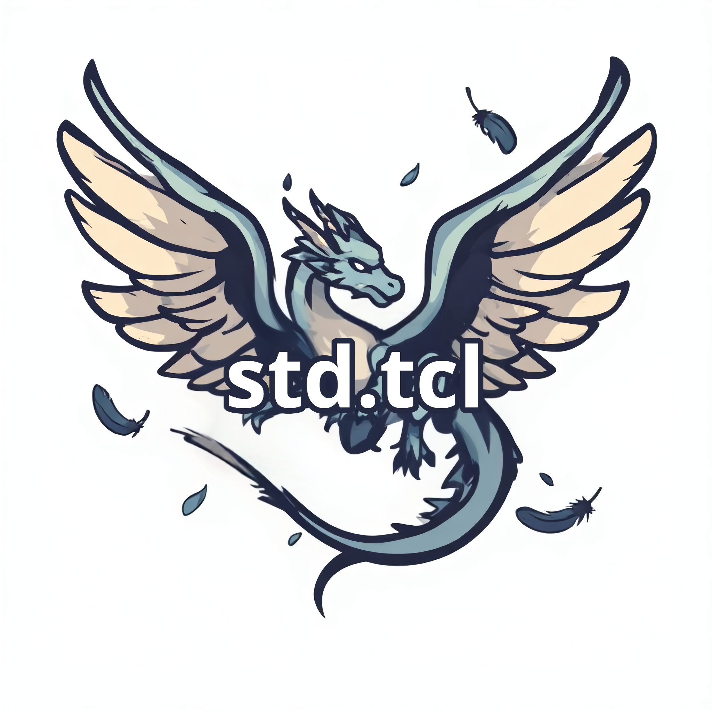

# std.tcl

<p align="center">
  
</p>

`std.tcl` is a  C++17 Tcl extension that exposes standard C++ library APIs—including containers and threading—as a native Tcl package.

This repository currently ships two package families:

- `std::containers` for vector, list, stack, set, and unordered_map style commands.
- `std::thread` for mutexes, condition variables, and thread helpers.

It now also builds a unified `std` shared module with `Std_Init(Tcl_Interp*)`, so one load can initialize both families.

## Requirements

- Tcl 8.6+
- CMake 3.16+
- C++17 compiler (GCC, Clang, or MSVC)
- POSIX threads support (or equivalent platform threading support)

## Quickstart

### 1) Update submodules

```bash
git submodule update --init --recursive
```

### 2) Build

```bash
cmake -S . -B build -DCMAKE_BUILD_TYPE=Release -DCMAKE_INSTALL_PREFIX=$(echo 'puts [file dirname [info library]]' | tclsh)
cmake --build build -j
cmake --install build
```

Expected artifact:

- `build/std.so` on Linux
- `build/std.dylib` or `build/std.so` depending on macOS toolchain setup
- `build/std.dll` on Windows

### 3) Load and use in Tcl

#### Containers Example

```tcl
package require std 0.1.0

set v [::std::vector::new]
::std::vector::push v 1 2 3
puts [::std::vector::at $v 0]  ;# 1
puts [::std::vector::size $v] ;# 3
```

```bash
tclsh containers/demo/demo_package.tcl
```

#### Thread Example

```tcl
set init {
    package require std 0.1.0
    proc multi10Vec {vVar start end} {
        upvar $vVar v
        for {set i $start} {$i < $end} {incr i} {
            std::vector<int>::set v $i [expr {$i * 10}]
        }
    }
}

eval $init

proc demo {N init numThreads} {
    puts "demo numThreads=$numThreads"
    set v [std::vector<int>::new.shared]
    for {set i 0} {$i < $N} {incr i} {
        std::vector<int>::push v $i
    }
    set t_total [time {
        if {$numThreads == 1} {
            set length [std::vector<int>::size $v]
            set t_thread [time {multi10Vec v 0 $length}]
        } else {
            set threads {}
            for {set id 0} {$id < $numThreads} {incr id} {
                set t [::std::thread::new {{{string init} {int numThreads} {int id} v} {
                    eval $init
                    set length [std::vector<int>::size $v]
                    set start [expr {int($id * $length / $numThreads)}]
                    if {$id == $numThreads - 1} {
                        set end $length
                    } else {
                        set end [expr {int(($id + 1) * $length / $numThreads)}]
                    }
                    multi10Vec v $start $end
                }} $init $numThreads $id $v]
                lappend threads $t
            }
            foreach t $threads {
                ::std::thread::join $t
            }
            ::std::thread::invalidateStringRep v
        }
    }]
    puts "t_total: $t_total"
    puts [std::vector<int>::at $v 1]
    puts [std::vector<int>::at $v [expr {$N / 2}]]
    puts [std::vector<int>::at $v [expr {$N - 1}]]
}

demo 10000000 $init 1
demo 10000000 $init 4
```

```bash
tclsh thread/demo/thread_package.tcl
```

## Build and Install

### Get Tcl lib directory

Find where Tcl installs packages:

```bash
echo 'puts [file dirname [info library]]' | tclsh
```

Use output as CMAKE_INSTALL_PREFIX:

```bash
cmake -S . -B build -DCMAKE_BUILD_TYPE=Release -DCMAKE_INSTALL_PREFIX=$(echo 'puts [file dirname [info library]]' | tclsh)
cmake --build build -j
cmake --install build
```

After install, Tcl finds package via normal lookup path.

## Component Documentation

Detailed API references and examples for each component:

- [containers/README.md](containers/README.md) — vector, list, stack, set, unordered_map
- [thread/README.md](thread/README.md) — mutex, condition_variable, thread, this_thread


## Notes

- The unified `Std_Init` calls both `Stdcontainers_Init` and `Stdthread_Init`.
- The module provides package `std 0.1.0` and also provides subpackages initialized by those components.

## License

MIT License — see [LICENSE.md](LICENSE.md) for details.
